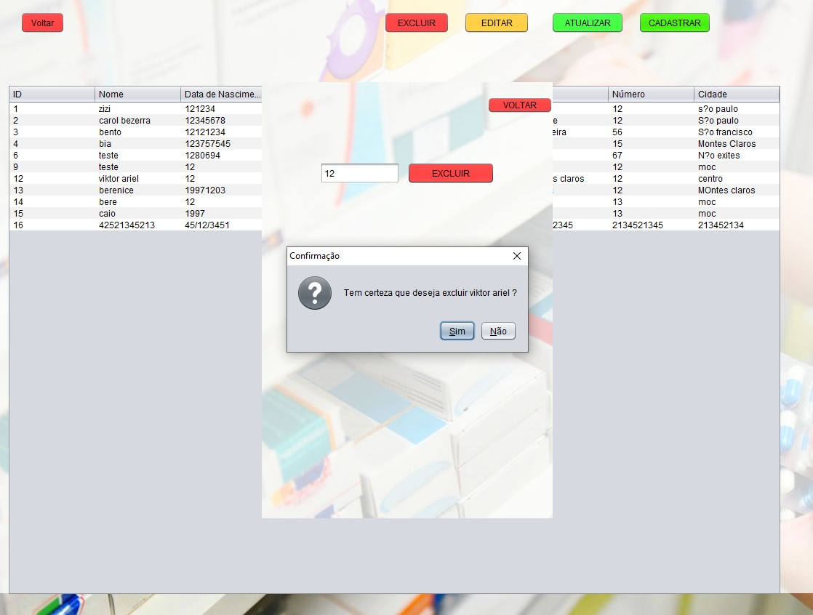
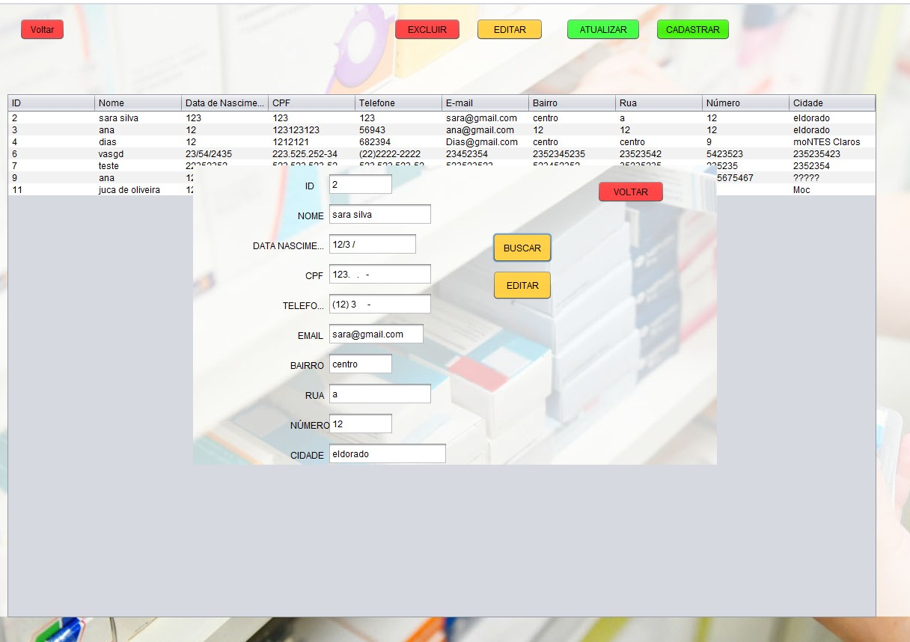
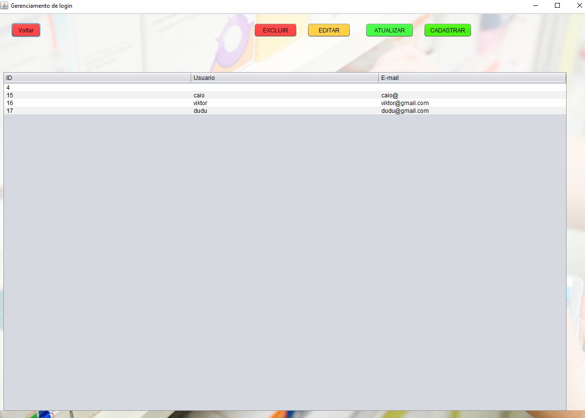
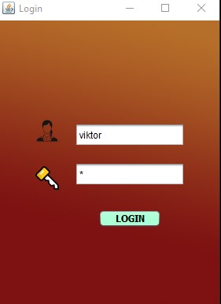
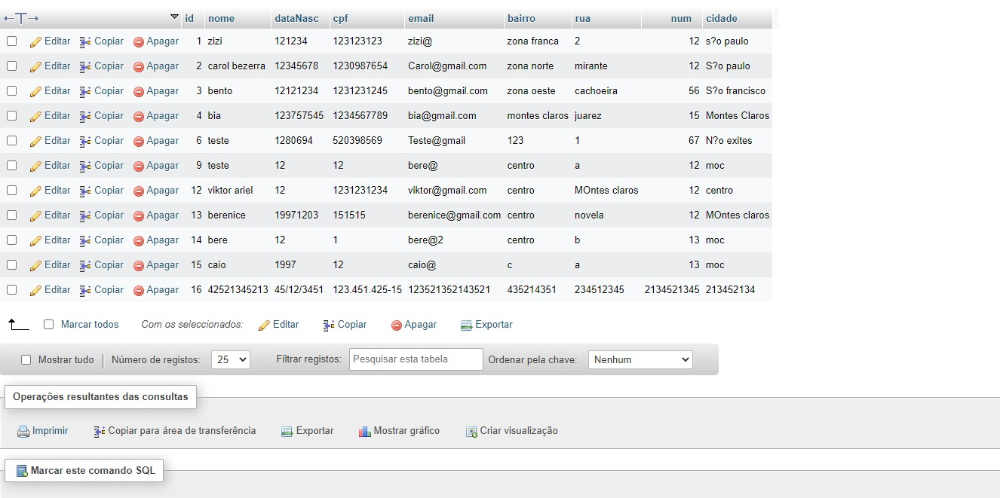
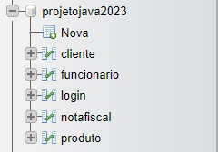
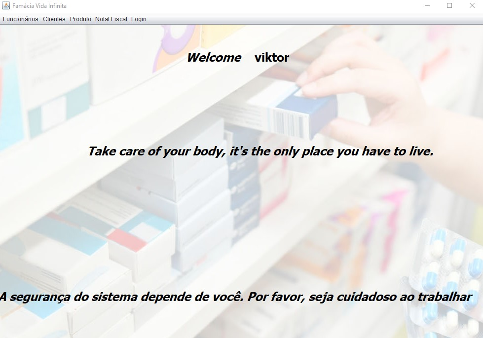

<h1>FARMÁCIA - JAVA + SQL 🧮</h1>

<h2>Sistema de uma FARMÁCIA feito em JAVA, JFrame, MySQL.</h2>

<h2>Explicação:</h2>

O Sitema dessa famácia cadastra, edita, exclui e lê os cliente, funcionários, remédios e nota fiscal de um estabelecimento. Seguindo os conceitos do CRUD.

<h2>💻Tecnologias</h2>

- JAVA 

- MySQL 

- JFrame 

- GIT e GitHub 

<h2>📱Contato</h2>

viktorariel777@gmail.com

